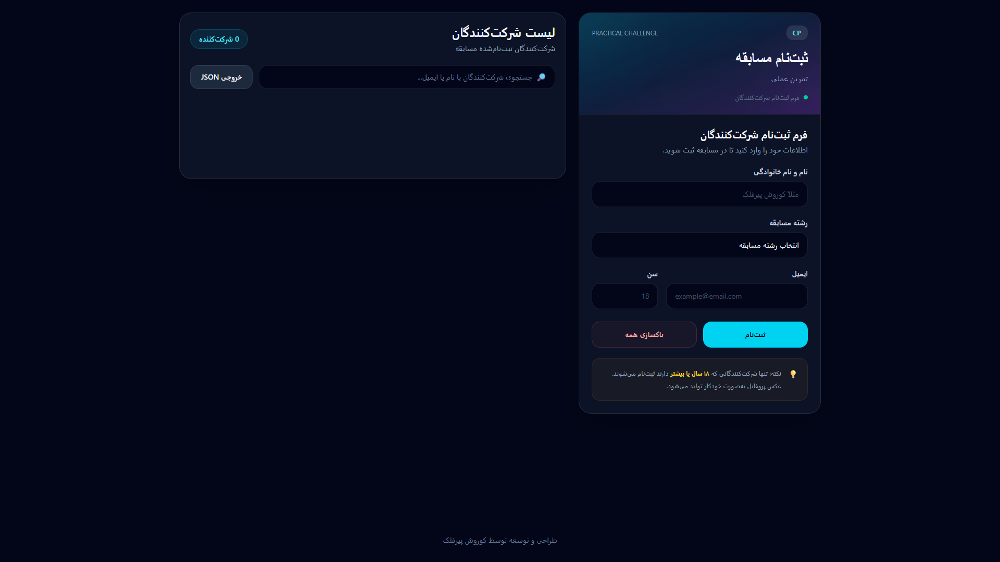

<p align="center">
  🇺🇸 <strong>English</strong> | 🇮🇷 <a href="./README.fa.md">فارسی</a>
</p>

<h1 align="center">🏆 Competition Registration App</h1>

<p align="center">
  
</p>

<p align="center">
  A responsive competition registration web app built with HTML, Tailwind CSS, and Vanilla JavaScript.
</p>

<p align="center">
  
  
  
  
</p>

<p align="center">
  <a href="YOUR_GITHUB_PAGES_URL">
    
  </a>
</p>

---

## 📖 Description

Competition Registration App is a responsive front-end project designed to simulate a competition registration system.

Users can register participants, search through registered participants, remove individual participants, clear all registrations, and export the participant data as a JSON file.

The project was built as part of my front-end development practice, with a focus on JavaScript logic, DOM manipulation, form validation, browser storage, event handling, and responsive UI design.

---

## ✨ Features

- 📝 Participant registration
- ✅ Form validation
- 🔞 Minimum age requirement of 18
- 🔎 Search participants by name or email
- 🗑️ Delete individual participants
- 🧹 Clear all participants
- 💾 Persistent data storage with LocalStorage
- 🔢 Real-time participant count
- 📦 Export participant data as JSON
- 📱 Fully responsive design
- 🎨 Modern dark UI
- ⚡ Lightweight and client-side based

---

## 🚀 Getting Started

### 1. Clone the repository

```bash
git clone YOUR_REPOSITORY_URL
```

### 2. Navigate to the project

```bash
cd competition-registration-app
```

### 3. Install dependencies

```bash
npm install
```

### 4. Start Tailwind CSS

```bash
npm run dev
```

This starts Tailwind CSS in watch mode and automatically generates the compiled CSS file.

### 5. Run the project

Open `index.html` using a local development server such as **Live Server**.

---

## 🛠 Tech Stack

<p>
  
  
  
</p>

### Additional Web APIs

- LocalStorage
- Blob API
- URL.createObjectURL()
- DOM API
- Form Validation API

---

## 🧠 JavaScript Concepts Practiced

This project helped me practice and apply several JavaScript concepts in a real project:

- DOM manipulation
- Event listeners
- Event delegation
- Event handling
- Array methods such as `forEach()`, `filter()`, and `splice()`
- Objects and arrays
- Functions and parameters
- Template literals
- JSON serialization and parsing
- `localStorage`
- Form validation
- `dataset`
- `insertAdjacentHTML()`
- Browser APIs
- Dynamic UI rendering
- Search and filtering logic

---

## 💾 Data Persistence

Participant data is stored in the browser using `localStorage`.

This means registered participants remain available even after refreshing or reopening the page in the same browser.

The application serializes the participant array using `JSON.stringify()` and restores it using `JSON.parse()`.

---

## 🔍 Search

The application provides real-time participant search.

Users can search by:

- Participant name
- Email address

The search uses JavaScript's `filter()` method to create a list containing only matching participants.

---

## ✅ Form Validation

The registration form includes client-side validation for:

- Required fields
- Full name
- Email format
- Age
- Competition track

Only participants who are **18 years old or older** can register.

The validation system also prevents multiple error messages from unnecessarily stacking on the form.

---

## 📦 JSON Export

Registered participants can be exported as a JSON file.

The application uses the browser's `Blob` API and temporary object URLs to generate the downloadable JSON file directly on the client side.

No backend server is required.

---

## 📱 Responsive Design

The interface is fully responsive and adapts to different screen sizes.

| Device              | Status |
| :------------------ | :----: |
| 🖥️ Large Desktop    |   ✅   |
| 💻 Desktop & Laptop |   ✅   |
| 📟 Tablet           |   ✅   |
| 📱 Mobile           |   ✅   |

---

## 📂 Project Structure

```text
📦 competition-registration-app/

├── .vscode/
│   └── tasks.json
├── assets/
│   └── screenshots/
│       └── hero.png
├── js/
│   └── script.js
├── src/
│   ├── input.css
│   └── output.css
├── .gitignore
├── index.html
├── package-lock.json
├── package.json
├── README.fa.md
└── README.md
```

---

## 🌐 Live Demo

The project will be deployed using **GitHub Pages**.

Once GitHub Pages is enabled, the live demo will be available here:

**YOUR_GITHUB_PAGES_URL**

---

## 👨‍💻 Author

**Korosh Pirfalak**

Front-End Developer in Progress

---

⭐ If you find this project useful or interesting, consider giving it a star!
